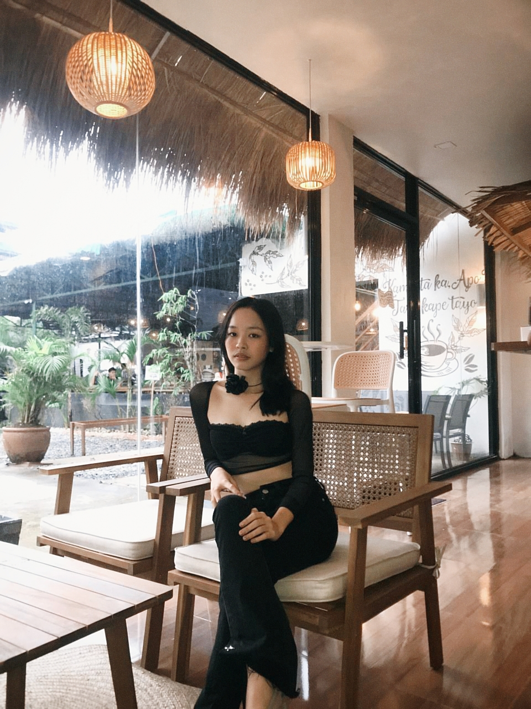

<!DOCTYPE html>
<html lang="en">
<head>
    <meta charset="UTF-8">
    <meta name="viewport" content="width=device-width, initial-scale=1.0">
    <title>Angela's Website</title>
    <link rel="stylesheet" href="https://cdnjs.cloudflare.com/ajax/libs/font-awesome/6.4.0/css/all.min.css">
    <link rel="stylesheet" href="css/style.css">        
</head>
<body>
    <!-- Navigation -->
    <nav class="nav">
        

            <button class="back-btn"><a href="front.html">← Back</a></button>
            <a class="logo">Personal Portfolio</a>
            <ul class="nav-links">
                <li><a href="#home" class="nav-link">Home</a></li>
                <li><a href="#subjects" class="nav-link">Skills and Hobbies</a></li>
                <li><a href="#achievements" class="nav-link">Achievements</a></li>
                <li><a href="#contact" class="nav-link">About me</a></li>
            </ul>
            

                <i class="fas fa-bars"></i>
            

        

    </nav>

    <!-- Hero Section -->
    <section id="home" class="hero">
        

            <h1 class="hero-title">Hi! My name is Angela Landicho Hernandez </h1>
            
I'm a first-year BSIT student at Batangas State University   JPLPC Malvar Campus under the College of Informatics and Computing Sciences.

            

                <a href="#subjects" class="btn btn-outline">My Skills & Hobbies</a>
                <button class="btn" onclick="showMotivation()">Daily Motivation</button>
            

           
        

        

            
    

</section>
   

    <!-- Subjects Section -->
    <section id="subjects" class="skills">
        

            <h2>My Skills and Hobbies</h2>
            

                

                    

                        
                    

                    <h3>Mathematics</h3>
                    
I'm good at solving mathematical problems sometimes.

                    

                

                    

                        
                    

                    <h3>Hobbies</h3>
                    
- I like reading chinese novels and also manhua or manhwa
 - Crocheting, I love to make handmade gifts and clothes for myself
 - I have creative hands and mind, I make costumes
.

                

                

                    

                        
                    

                    <h3>Programming</h3>
                    
Basic knowledge in programming .

                

            

        

    </section>

    <!-- Achievements Section -->
    <section id="achievements" class="projects">
        

            <h2>My Achievements</h2>
            

                

                   
                    

                        <h3>Honor Roll Student</h3>
                        
Honor Student  for 4 consecutive years (2022-2025).

                        

                            Academic
                            2025
                        

                    

                

                

                    
                    

                        <h3>Pagent</h3>
                        
Bb. Looc 2024 1st runner up with 6 special awards.

                        

                            Competition
                            2024
                        

                    

                

                
        

    </section>

    <!-- Contact Section -->
    <section id="contact" class="contact">
        

            <h2>About me</h2>
            

                

                    
I'm 18 years old  
                   My birthday is on September 05, 2007  
                   I live in Looc, Balete, Batangas  
                     

                    

                        

                            <i class="fas fa-envelope"></i>
                        

                        

                            <h3>Email</h3>
                            
ghel05hernand3z@gmail.com

                        

                    

                    

                        

                            <i class="fas fa-phone"></i>
                        

                        

                            <h3>Phone</h3>
                            
+63 9913400433

                        

                    

                    

                        

                            <i class="fas fa-map-marker-alt"></i>
                        

                        

                            <h3>Campus</h3>
                            
Batangas State University JPLPC Malvar Campus

                        

                    

                

                         
            

    </section>

    
</body>
</html>