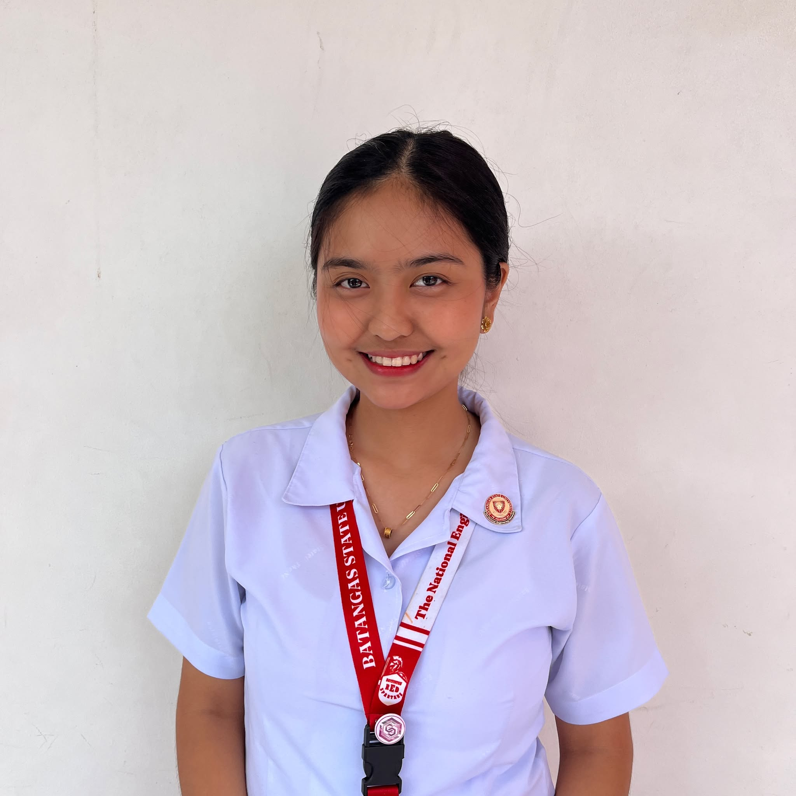
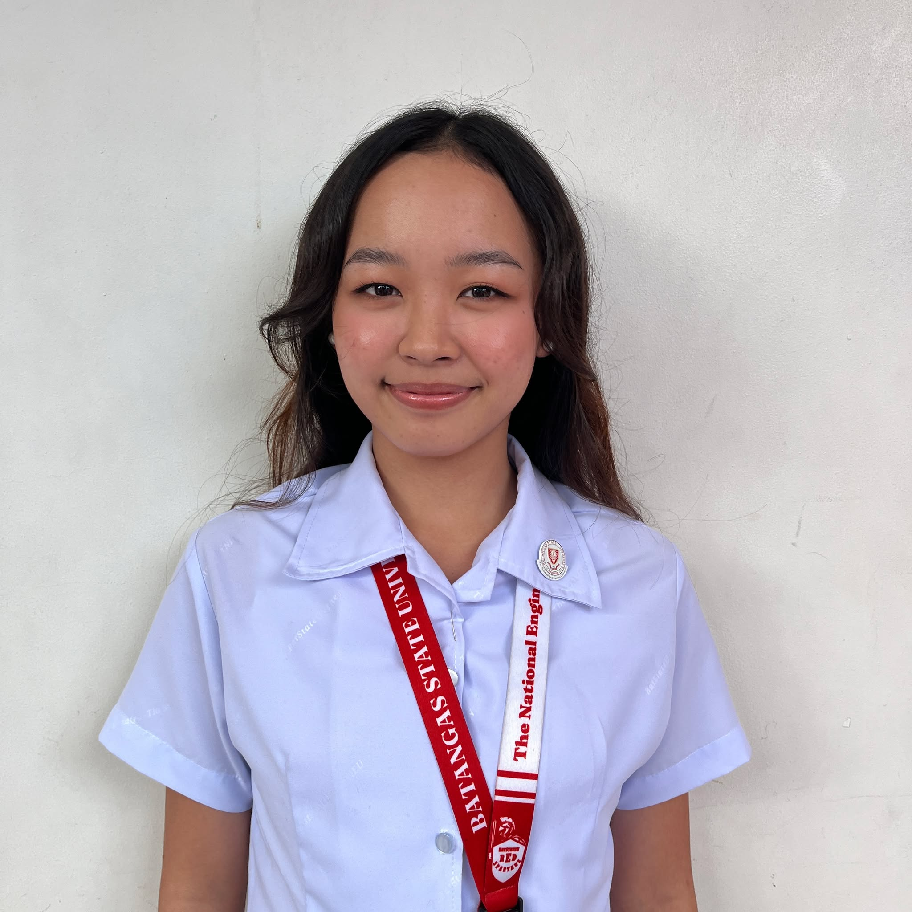
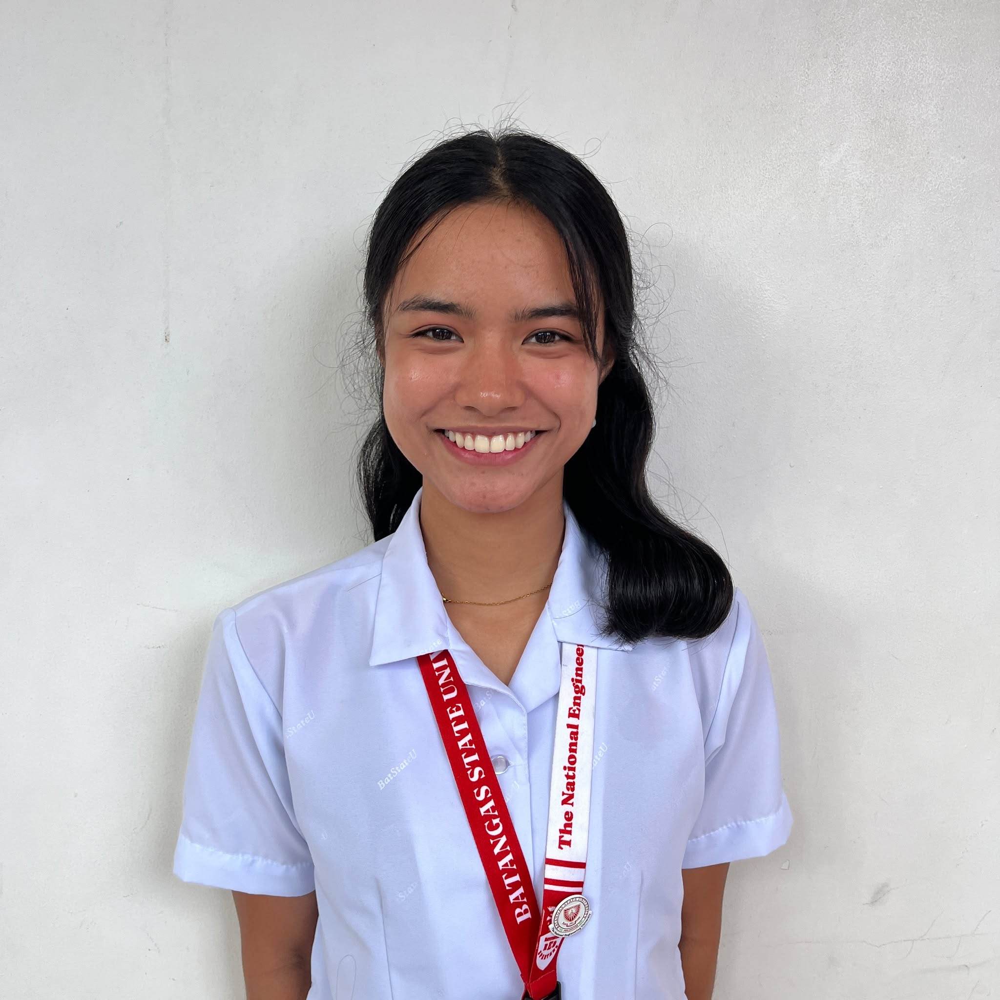
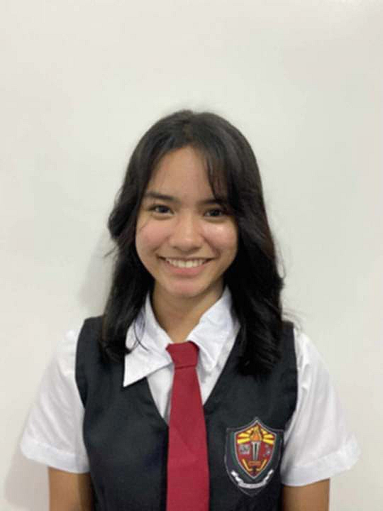

[front.html](https://github.com/user-attachments/files/24014288/front.html)
<!DOCTYPE html>
<html lang="en">
<head>
    <link rel="icon" href="bsulogo.png" type="image/png" />   
    <meta charset="UTF-8">
    <link rel="stylesheet" href="https://cdnjs.cloudflare.com/ajax/libs/font-awesome/6.4.0/css/all.min.css">
    <link rel="stylesheet" href="Cha-ph/style.css">
    <meta name="viewport" content="width=device-width, initial-scale=1.0">
    <title>Batangas State University</title>

</head>
<body>
    <nav class="top-nav">
        <button class="hamburger" id="hamburger-btn">
            
            
            
        </button>
        

            <a href="#" onclick="showSection('home')">Home</a>
            <a href="#" onclick="showSection('about')">About Us</a>
            <a href="#" onclick="showSection('video')">Promotional Video</a>
            <a href="#" onclick="showSection('outputs')">Outputs</a>
        

    </nav>
    

        <aside class="left-nav" id="sidebar">
             
            <h2>Group Members</h2>
            <ul>
                <li><a href="Lorin_Personal_Porfolio/Website.html" target="_blank">Lorin Dimaano</a></li>
                <li><a href="charles/Website.html" target="_blank">Charles Hernandez</a></li>
                <li><a href="Jess_Personal_Porfolio/Website.html" target="_blank">Jessie Guevarra</a></li>
                <li><a href="Kent_Personal_Porforlio/Website.html" target="_blank">Kent Delena</a></li>
                <li><a href="Kathryn_Personal_Porfolio/Website.html" target="_blank">Kathryn Laurel</a></li>
                <li><a href="Nathan_Personal_Porfolio/Website.html" target="_blank">Nathaniel Ingal</a></li>
                <li><a href="Cnaida_Personla_Porfolio/Website.html" target="_blank">Cnaida Ibusag</a></li>
                <li><a href="Carl_Personal_Porfolio/Website.html" target="_blank">Carl Jefferson</a></li>
                <li><a href="Angela_Personal_Porfolio/Website.html" target="_blank">Angela Hernandez</a></li>
                <li><a href="Zharia_Personal_Porfolio/Website.html" target="_blank">Zaira Landicho</a></li>
                <li><a href="Jc_Personal_Porfolio/Website.html" target="_blank">John Christian Hernandez</a></li>
            </ul>
        </aside>
        <main class="content">
            <section id="home" class="section active">
                <h1>Welcome to Batangas State University</h1>
                

                    <h3><strong>MALVAR CAMPUS</strong></h3>
                    
Integrated into the university in 2001, BatStateU-JPLPC Malvar specializes in industrial technology programs and plays a key role in the urbanization and industrial development of Malvar. Situated on a 3.26-hectare campus, it serves over 6,000 students from various parts of Batangas. The campus features modern facilities and buildings,   with most programs offered under the College of Industrial Technology.
                    

                

                 
                

                    <h3><strong>VISION</strong></h3>
                    
A premier national university that develops leaders in the global knowledge economy.

                

                

                    <h3><strong>MISSION</strong></h3>
                    
A university committed to producing leaders by providing a 21st century learning environment through innovations in education, multidisciplinary research, and community and industry partnerships in order to nurture the spirit of nationhood, propel the national economy, and engage the world for sustainable development.

                

                

                    <h3><strong>CORE VALUES</strong></h3>
                    <li>Patriotism   
                        Service  
                        Integrity  
                        Resilience  
                        Excellence  
                        Faith    
                    </li>
                

                 
                    
 
        <h3><strong>PROGRAMS AVAILABLE</strong></h3>
        
<a href="https://batstateu.edu.ph/programs/engineering-technology/" target="_blank" style="text-decoration: none;"><em><b>→College of Engineering Technology←</b></em>

         
        
<a href="https://batstateu.edu.ph/campuses/malvar/college-of-teacher-education/" target="_blank" style="text-decoration: none;"><em><b>→College Of Teacher Education←</b></em></a>
 
         
        
<a href="https://batstateu.edu.ph/campuses/malvar/college-of-engineering/" target="_blank" style="text-decoration: none;"><em><b>→College Of Engineering←</b></em></a>
 
         
        
<a href="https://batstateu.edu.ph/campuses/malvar/college-of-informatics-and-computing-sciences/" target="_blank" style="text-decoration: none;"><em><b>→College Of Informatics and Computing Sciences←</b></em></a>
 
         
        
<a href="https://batstateu.edu.ph/campuses/malvar/college-of-arts-and-sciences/" target="_blank" style="text-decoration: none;"><em><b>→College of Arts and Sciences←</b></em></a>
 
         
        
<a href="https://batstateu.edu.ph/campuses/malvar/cabeihm/" target="_blank" style="text-decoration: none;"><em><b>→College of Accountancy, Business, Economics and International Hospitality Management←   →(CABEIHM)←</b></em></a>
 
    

     

 
    <h3><strong>ORGANIZATIONS</strong></h3>
    

        

         	
<a href="https://www.facebook.com/sscmalvar" target="_blank" style="text-decoration: none;"><em><b>Supreme Student Council BatState Malvar</b></em></a>

            
"The highest governing body of all the student organizations in the university and they intend to take an active participation in all schools and community activities and spearhead programs for the welfare of the students."

            

        

    

    

        

            

                    

                

            

        

    

 

    

        

            

                

                    

        	
<a href="https://www.facebook.com/jmebatstateumalvar" target="_blank" style="text-decoration: none;"><em><b>Junior Marketing Executives</b></em></a>

            
"The Junior Marketing Executive- Malvar Campus envisions itself to be a channel that will nurture the students towards becoming the finest Marketing Professional and Country’s future leader. To lead the business students into the 21st century through marketing excellence."

            
 
            

                    

                

            

        

            

                

                    

                        

                        

                    

                

            

    

 

    

        

            

                

                    

                
<a href="https://www.facebook.com/CICSSC.Malvar" target="_blank" style="text-decoration: none;"><em><b>College of Informatics and Computing Science Student Council</b></em></a>

                    
"The College of Informatics and Computing Sciences Student Council is defined as the independent governing body of the information technology and computer science students of Batangas State University TNEU JPLPC-Malvar. The organization shall develop a higher sense of respect and responsibility that will enable students to maximize their educational opportunities, relative to development among students. Also, facilitate, provide, and support new technologies, with the objective to integrate, foster, and promote the development of imagination, creativity, and innovation in students, professors and faculty."

                        

                    

                

            

        

            

                

                    

                        

                        

                    

                

            

    

 

            </section>
            <section id="about" class="section">
    <h1>About Us</h1>
    

        <h3>PRESENTED BY: GROUP 2</h3>
        <button class="openmodal myBtn flip-card"> 
            

                

                    
                

                

                    <h6>LEADER   The  WEB DEVELOPER 1 Click for more info</h6>
                

            

        </button>
         
         
        <button class="openmodal myBtn flip-card">
            

                

                    
                

                

                    <h6>The  WEB DEVELOPER 2 Click for more info</h6>
                

            

        </button>
         
         
        <button class="openmodal myBtn flip-card">
            

                

                    
                

                

                    <h6>The  VIDEO EDITOR/ VIDEOGRAPHER 1 Click for more info</h6>
                

            

        </button>
        <button class="openmodal myBtn flip-card">
            

                

                    
                

                

                    <h6>The  VIDEOGRAPHER 2 Click for more info</h6>
                

            

        </button>
         
         
        <button class="openmodal myBtn flip-card">
            

                

                    
                

                

                    <h6>As the  MAIN CHARACTER 1 Click for more info</h6>
                

            

        </button>
        <button class="openmodal myBtn flip-card">
            

                

                    
                

                

                    <h6>As the  MAIN CHARACTER 2 Click for more info</h6>
                

            

        </button>
        <button class="openmodal myBtn flip-card">
            

                

                    
                

                

                    <h6>As the  CLASSMATE 1 Click for more info</h6>
                

            

        </button>
        <button class="openmodal myBtn flip-card">
            

                

                    
                

                

                    <h6>As the  PROFESSOR Click for more info</h6>
                

            

        </button>
         
         
        <button class="openmodal myBtn flip-card">
            

                

                    
                

                

                    <h6>As a  CAST MEMBER Click for more info</h6>
                

            

        </button>
        <button class="openmodal myBtn flip-card">
            

                

                    
                

                

                    <h6>As a  CAST MEMBER Click for more info</h6>
                

            

            </button>
            <button class="openmodal myBtn flip-card">
            

                

                    
                

                

                    <h6>As a  CAST MEMBER Click for more info</h6>
                

            

        </button>
        
     

    

        

            &times;
            
            
 Hi I'm <strong> Charles James A. Hernandez</strong>, a 1st Year BSIT student here at BSU JPLPC-Malvar Campus.   I'm the Leader and the Web Developer 1 in Group 2.  Nice meeting you!

        

    

    

        

            &times;
            
            
 Hi I'm <strong> Jessie F. Guevarra</strong>, a 1st Year BSIT student here at BSU JPLPC-Malvar Campus.   I'm the Web Developer 2 in Group 2.  Nice meeting you!

        

    

    

        

            &times;
            
            
 Hi I'm <strong> Princes Lorin G. Dimaano</strong>, a 1st Year BSIT student here at BSU JPLPC-Malvar Campus.   I'm the Video Editor and the  Videographer 1 in Group 2.  Nice meeting you!

        

    

    

        

            &times;
            
            
 Hi I'm <strong> Angela Landicho Hernandez</strong>, a 1st Year BSIT student here at BSU JPLPC-Malvar Campus.   I'm the Videographer 2 in Group 2.  Nice meeting you!

        

    

    

        

            &times;
            
            
 Hi I'm <strong> Zaira Le Ann D. Landicho</strong>, a 1st Year BSIT student here at BSU JPLPC-Malvar Campus.   I'm the Main Character 1 in Group 2.  Nice meeting you!

        

    

    

        

            &times;
            
            
 Hi I'm <strong> Kathryn Mae Laurel</strong>, a 1st Year BSIT student here at BSU JPLPC-Malvar Campus.   I'm the Main Character 2 in Group 2.  Nice meeting you!

        

    

    

        

            &times;
            
            
 Hi I'm <strong> Nathan Ingal</strong>, a 1st Year BSIT student here at BSU JPLPC-Malvar Campus.   I'm the Classmate 1 in Group 2.  Nice meeting you!

        

    

    

        

            &times;
            
            
 Hi I'm <strong> John Christian Hernandez</strong>, a 1st Year BSIT student here at BSU JPLPC-Malvar Campus.   I'm the Professor in Group 2.  Nice meeting you!

        

    

    

        

            &times;
            
            
 Hi I'm <strong> Cnaida Ibusag</strong>, a 1st Year BSIT student here at BSU JPLPC-Malvar Campus.   I'm a Cast Member in Group 2.  Nice meeting you!

        

    

    

        

            &times;
            
            
 Hi I'm <strong> Carl Jefferson Estrael</strong>, a 1st Year BSIT student here at BSU JPLPC-Malvar Campus.   I'm a Cast Member in Group 2.  Nice meeting you!

        

    

    

        

            &times;
            
            
 Hi I'm <strong> Kent Cedrick Delena</strong>, a 1st Year BSIT student here at BSU JPLPC-Malvar Campus.   I'm a Cast Member in Group 2.  Nice meeting you!

        

    

    
 
</section>
            <section id="video" class="section">
                <h1>Promotional Video</h1>
                

                    
Promotional Video

                    <video src="IMG_6303.mp4" controls width="1040" height="560" ></video>
                     
                     
                     
                

            </section>
            <section id="outputs" class="section">
                <h1>Outputs</h1>
                

                    
This is our outputs/activities

                    

        

        

        <button class="nav-btn prev" id="prevBtn">&lt;</button>
        <button class="nav-btn next" id="nextBtn">&gt;</button>
    

    <h2 class="justify">In the course Introduction to Computing, students demonstrate impressive dedication and perseverance in tackling the various activities assigned. From mastering fundamental programming concepts to applying problem-solving skills in real-world scenarios, each task requires critical 
        thinking, attention to detail, and consistent effort. Students show resilience as they navigate the challenges of coding assignments, troubleshooting errors, and learning new software tools. 
        Their hard work is evident in the steady progress they make, steadily building their confidence and understanding of the subject. This commitment not only helps them develop essential computing skills but also fosters a deeper appreciation for the complexities of technology in today's digital world. </h2>
     
     
     
                

            </section>
        </main>
    

    
</body>
<footer>@ 2025 ALL RIGHTS RESERVED - BATANGAS STATE UNIVERSITY</footer>
</html>
